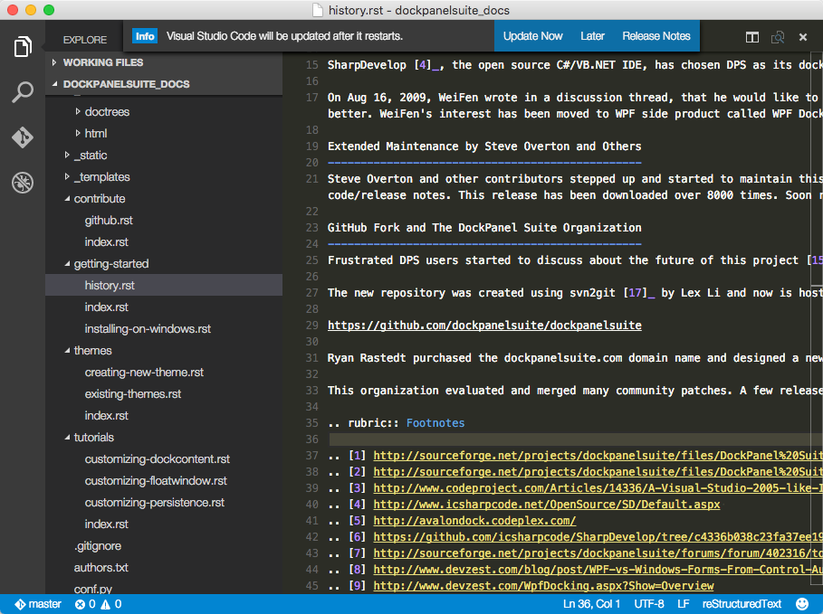

# reStructuredText Language Support for Visual Studio Code

 

>**Notice:**
> Homepage for this extension is at [GitHub](https://github.com/vscode-restructuredtext/vscode-restructuredtext)
> Starting from 32.0.0 release, all path settings require absolute paths.

This extension provides rich reStructuredText language support for Visual Studio Code.
Now you write reStructuredText scripts using the excellent IDE-like interface
that VS Code provides. With live preview enabled, final look-and-feel is just one click away.

## Features

- Syntax highlighting
- Code snippets
  - `code`  			Code block
  - `image` 			Image
  - `figure`            Figure
  - `link`  			Link
  - `attention` 		Attention
  - `note`				Note
  - `warning`			Warning
  - `error`				Error
  - `hint`				Hint
  - `important`			Important
  - `caution`			Caution
  - `danger`			Danger
  - `tip`				Tip
  - `admonition` 		Admonition
  - `rubric`			Rubric (footnote)
  - `doc`               Doc reference
  - `ref`               Label reference
  - `label`			Label
  - `download` 		Download
  - `file`				File
  - `kbd`				Keyboard Shortcut

  To trigger snippets, please refer to [Visual Studio Code shortcuts](https://code.visualstudio.com/docs/customization/keybindings).
  
- Live Preview (Experimental, and **Sphinx must be configured in advanced**)

  The shortcuts are

  - `ctrl+shift+r` (on Mac `cmd+shift+r`)      Preview
  - `ctrl+k r` (on Mac `cmd+k r`)              Preview to Side

>**Notice:** The preview feature requires Python to be installed. The `sphinx` Python module is also required. 
Check out the [steps to configure sphinx](docs/sphinx.md).

- Section Builder

  The shortcut is `ctrl+=` (on Mac `cmd+=`). 
  
  Pressing the shortcut key would convert the current line under the cursor to a section, by adding adornment (underlines below the title text).

  Pressing the shortcut key multiple times switches among the adornment characters.

- Linter (Experimental, and **restructuredtext-lint must be configured in advanced**)

>**Notice:** The linter feature requires `restructuredtext-lint` Python module. 
Check out the [steps to configure sphinx](docs/sphinx.md).
Due to the facts that `restructuredtext-lint` does not support all Sphinx directives, there can be many false positives in its ouput.

## How to install from Marketplace

This extension is hosted at [Visual Studio Marketplace](https://marketplace.visualstudio.com/items/lextudio.restructuredtext)

1. Upgrade to Visual Studio Code 1.3.0 or above.
1. Switch to the Extensions view by clicking the fifth icon in the left most bar.
1. Type "restructuredtext" in the search box and hit Enter key.
1. Click "Install" button to install "reStructuredText" extension.

## Contributing to the code

Check out the [development documentation](docs/development.md) for more details
on how to contribute to this extension!

Check the [dashboard on work items](https://waffle.io/vscode-restructuredtext/vscode-restructuredtext).

## License

This extension is [licensed under the MIT License](LICENSE.txt).  Please see the
[third-party notices](Third Party Notices.txt) file for details on the third-party
files that we include with releases of this project.

## Acknowledgements
### Logo
The project logo comes from [Legendora Icon](http://raindropmemory.deviantart.com/art/Legendora-Icon-Set-118999011) by [Teekatas Suwannakrua](http://raindropmemory.deviantart.com/).

### Linter
The linter support is based on [Cody Hoover's ruby-linter](https://marketplace.visualstudio.com/items?itemName=hoovercj.ruby-linter).

### Live Preview
The initial idea was brought from [Thomas Haakon Townsend's ReStructured Text Previewer](https://marketplace.visualstudio.com/items?itemName=tht13.rst-vscode), but soon after moving fully to Sphinx, this extension becomes its own beast.
