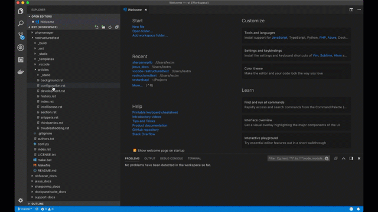

# reStructuredText Language Support for Visual Studio Code

This extension provides rich reStructuredText language support for Visual Studio Code.
Now you write reStructuredText scripts using the excellent IDE-like interface
that VS Code provides.

## Features

- Code Snippets
- Editor Enhancement
- Linter
- Syntax Highlighting (via [dependent extension](https://marketplace.visualstudio.com/items?itemName=trond-snekvik.simple-rst) by Trond Snekvik)
- IntelliSense (via [dependent extension](https://marketplace.visualstudio.com/items?itemName=swyddfa.esbonio) by Alex Carney)
- Live Preview (via [dependent extension](https://marketplace.visualstudio.com/items?itemName=swyddfa.esbonio) by Alex Carney)

Frequent Asked Questions can be found [here](https://github.com/vscode-restructuredtext/vscode-restructuredtext/issues?q=is%3Aissue+label%3A%22faq+candidate%22+).

## How to install from Marketplace

This extension is hosted at [Visual Studio Marketplace](https://marketplace.visualstudio.com/items/lextudio.restructuredtext)

1. Upgrade to Visual Studio Code 1.82.0 or above.
1. Switch to the Extensions view by clicking the fifth icon in the left most bar.
1. Type "restructuredtext" in the search box and hit Enter key.
1. Click "Install" button to install "reStructuredText" extension (by LeXtudio Inc.).

After installing this extension, please visit [the homepage for this extension](https://docs.restructuredtext.net) to learn how to use it.

## Contributing to the code

Check out the [development documentation](https://docs.restructuredtext.net/articles/development.html) for more details
on how to contribute to this extension!

## License

This extension is [licensed under the MIT License](LICENSE.txt).  Please see the
[third-party notices](https://docs.restructuredtext.net/articles/thirdparties.html) file for details on the third-party
files that we include with releases of this project.

## Acknowledgements
### Logo
The project logo comes from [Legendora Icon](http://raindropmemory.deviantart.com/art/Legendora-Icon-Set-118999011) by [Teekatas Suwannakrua](http://raindropmemory.deviantart.com/).

### Linter
The linter support is based on [Cody Hoover's ruby-linter](https://marketplace.visualstudio.com/items?itemName=hoovercj.ruby-linter). Either rstcheck or doc8 can be used as default linter.
